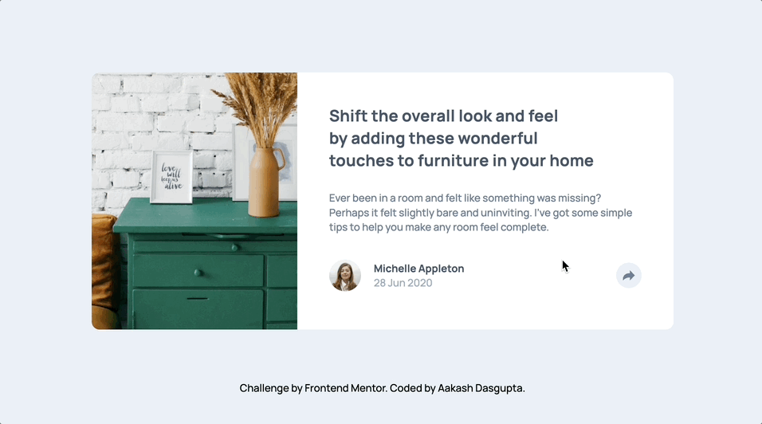
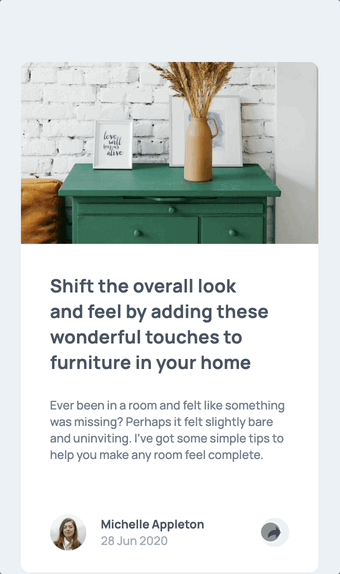

# Frontend Mentor - Article preview component solution

This is a solution to the [Article preview component challenge on Frontend Mentor](https://www.frontendmentor.io/challenges/article-preview-component-dYBN_pYFT). Frontend Mentor challenges help you improve your coding skills by building realistic projects. 

## Table of contents

- [Overview](#overview)
  - [The challenge](#the-challenge)
  - [Screenshot](#screenshot)
  - [Links](#links)
- [My process](#my-process)
  - [Built with](#built-with)
  - [What I learned](#what-i-learned)
  - [Useful resources](#useful-resources)
- [Author](#author)

## Overview

### The challenge

Users should be able to:

- View the optimal layout for the component depending on their device's screen size
- See the social media share links when they click the share icon

### Screenshot

| Feature  | Preview |
|----------|---------|
| Desktop View |  |
| Mobile View |  |

### Links

- Solution URL: [Link](https://github.com/a-d14/article-preview-frontend-mentor)
- Live Site URL: [Link](https://a-d14.github.io/article-preview-frontend-mentor)

## My process

### Built with

- Semantic HTML5 markup
- CSS custom properties
- Flexbox
- CSS Grid
- Mobile-first workflow
- JavaScript

### What I learned
I learned how to make customized tooltips for elements.

### Useful resources

- [Tooltip Creation](https://blog.logrocket.com/creating-beautiful-tooltips-with-only-css) - This helped me learn the concepts behind creating custom tooltips.

## Author
- Frontend Mentor - [@a-d14](https://www.frontendmentor.io/profile/a-d14)

## Acknowledgments
I would like to thank [Darkstar](https://www.frontendmentor.io/profile/DarkstarXDD/solutions) for helping me debug some issues with animation in this project.